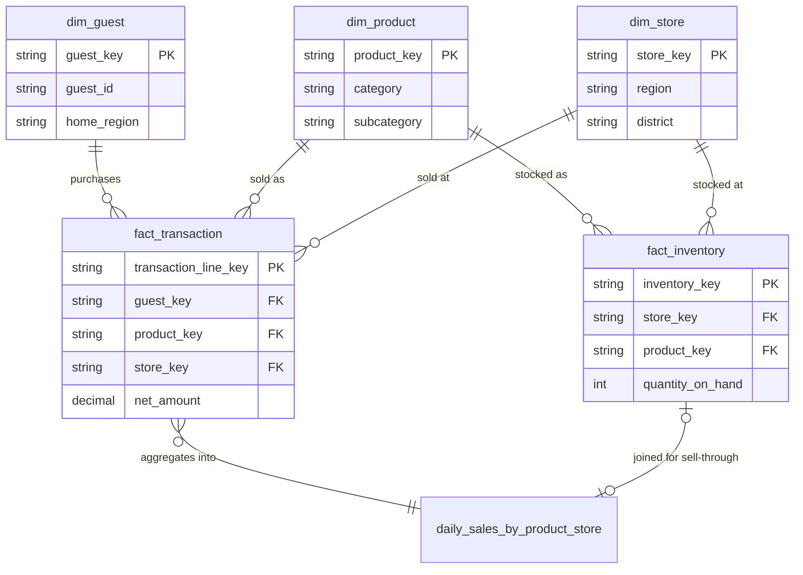

# Architecture — Retail Semantic Layer

This is the business-context layer for the project: entity definitions, relationships, business rules, and the reasoning behind how Genie is wired to the semantic layer. It's meant to be readable on its own, without deploying anything.

## Entity-relationship diagram

## Canonical entities

These five map directly to the JD's own language ("customer/guest, product, store, transaction, inventory") — this project treats that as the literal scope of the enterprise data model, not a paraphrase.

| Entity | Grain | Definition |
|---|---|---|
| **Guest** | One row per guest | A person who has registered or transacted with the business. Distinct from "guest visits" or "sessions" — this is the identity dimension. |
| **Product** | One row per SKU | A sellable item, with a two-level merchandise hierarchy (category → subcategory). |
| **Store** | One row per physical store | A selling location, with a two-level geography hierarchy (region → district). |
| **Transaction** | One row per product per basket (line item) | Not one row per basket — a single checkout with 3 items produces 3 transaction rows. This is a deliberate grain choice: it's the finest grain that still lets `Transaction Count` (distinct baskets) and `Units Sold` (line-item sum) both be derived correctly from the same fact table. |
| **Inventory** | One row per store, product, and snapshot date | A daily on-hand count, not a running ledger of receipts/shipments — sufficient for sell-through and turnover measures, not for full inventory accounting. |

## Business rules

- **Net Sales excludes tax and is net of discounts**: `net_amount = quantity * unit_price - discount_amount`. Tax is tracked separately (`tax_amount`) and is never included in a "sales" measure.
- **Transaction Count means distinct baskets, not line items** — always `COUNT(DISTINCT transaction_id)`, never `COUNT(*)` on the fact table.
- **Sell-Through Rate** = `Units Sold / (Units Sold + Ending Units On Hand)`. This is an approximation: the demo dataset tracks on-hand snapshots, not units-received, so "beginning inventory" isn't available. A production semantic layer would define this against received units; the formula and its limitation are stated explicitly here rather than silently baked into the metric.
- **Inventory Turnover** = `Units Sold / Average Units On Hand` over the selected period — a simple turnover proxy, not COGS-based turnover.

## Hierarchies

- **Product**: Category → Subcategory (e.g. Bottoms → Leggings).
- **Store geography**: Region → District → Store (e.g. South → South-1 → a specific store).
- **Guest geography**: Home Region only (one level) — deliberately shallower than store geography, since guest-level district/city data isn't part of this demo's scope.

These hierarchy columns live directly on `dim_product` / `dim_store`, not in a separate table — for a semantic layer this size, a hierarchy is just a column, not a graph.

## Why tables *and* metric views — the two-tier design

This is the direct answer to the JD's "business context layer" language, and it's a platform pattern, not a diagram:

1. **Tier 1 — the gold star schema** (`dim_guest`, `dim_product`, `dim_store`, `fact_transaction`, `fact_inventory`, `daily_sales_by_product_store`). Every fact table carries informational `PRIMARY KEY` / `FOREIGN KEY` constraints (`NOT ENFORCED, RELY`) — not for runtime enforcement, but so the constrained relationships are visible to Unity Catalog's lineage/discoverability tooling and to Genie itself, which uses declared constraints to reason about how tables join. This tier is exploratory: correct joins are guaranteed, but there's no guarantee two different people compute "sales" the same way against it.
2. **Tier 2 — the metric views** (`sales_metrics`, `inventory_metrics`). These are where "Net Sales," "Sell-Through Rate," etc. get one canonical, governed definition, expressed once in YAML and reused everywhere (SQL, BI, Genie) — this is the actual semantic layer, in the sense the JD uses the term.

**Genie is configured to prefer Tier 2.** The Genie space's instructions tell it to answer any question that matches a defined measure using the metric views first, and to fall back to the Tier 1 tables only for exploratory questions the metric views don't cover (e.g. "how many products does Ascend Athletics carry" — a question about the catalog, not a KPI). This tiering is what keeps "ask Genie anything" from silently producing a different definition of Net Sales every time someone rephrases the question — the risk called out by the JD's "consistent definitions, metrics, and meaning across all consumption patterns."

## Metric definitions

| Metric View | Measure | Formula | Business meaning |
|---|---|---|---|
| `sales_metrics` | Net Sales | `SUM(net_amount)` | Gross sales minus discounts, excluding tax |
| `sales_metrics` | Units Sold | `SUM(quantity)` | Line-item unit volume |
| `sales_metrics` | Transaction Count | `COUNT(DISTINCT transaction_id)` | Distinct baskets |
| `sales_metrics` | Average Order Value | `Net Sales / Transaction Count` | Basket economics |
| `sales_metrics` | Guest Count | `COUNT(DISTINCT guest_key)` | Distinct transacting guests |
| `inventory_metrics` | Units On Hand | `SUM(quantity_on_hand)` | On-hand snapshot total |
| `inventory_metrics` | Sell-Through Rate | `Units Sold / (Units Sold + Units On Hand)` | Demand vs. supply (approximation — see Business Rules) |
| `inventory_metrics` | Inventory Turnover | `Units Sold / Average Units On Hand` | Simple turnover proxy |

## The data story

The synthetic bronze generator seeds two correlated, non-uniform signals so the metrics above have something real to show (see `src/bronze/generate_synthetic_retail_data.py` docstring for the exact mechanics):

1. A one-week promo lifts transaction volume for the Bottoms category, nationally.
2. South region stores start the following two-week inventory window already under-stocked on Bottoms, so the post-promo demand drains them to a near-zero on-hand stockout by the end of the window.

Ask Genie something like *"which region has the highest sell-through on Bottoms this period?"* and the answer should point at South. This is verified against real deployed data, not just designed: South's `Units On Hand` for Bottoms (51,480) is dramatically lower than every other region (720K–961K, per the seeded under-stocking), and because Sell-Through Rate is `units_sold / (units_sold + on_hand)`, that low denominator makes South's ratio the highest of the four regions (0.0129 vs. 0.0015–0.0046 elsewhere) — the correct retail signal for "at risk of stockout," and traceable end to end from `inventory_metrics` back through the gold tables to the generator's seeded assumptions.

## Design trade-offs

- **Fixed catalog/schema names in metric-view SQL and the Genie space JSON.** Bundle variables (`catalog`, `gold_schema`) parameterize every *structured* resource field, but DABs doesn't template `${var...}` inside the *contents* of referenced SQL/JSON files — only Lakeflow Declarative Pipeline `configuration:` values get re-injected into SQL text. So `sales_metrics.sql`, `inventory_metrics.sql`, and the Genie space JSON hardcode `retail_semantics_demo.gold.*`. Accepted deliberately: this is a single-target portfolio demo, and `IDENTIFIER()`-based dynamic SQL to support arbitrary renaming adds real complexity for a scenario nobody will exercise in an interview. If you rename the catalog/schema variables before deploying, those two artifacts need a manual find/replace — noted prominently in the README.
- **Catalog/schema creation runs as a SQL task inside the job, not as a declarative `resources.catalogs`/`resources.schemas` bundle resource.** Discovered during deployment, not designed in from the start: on the workspace this was built against, the Unity Catalog REST API that Terraform/DABs calls for a declarative catalog resource (`POST /api/2.1/unity-catalog/catalogs`) returned `Metastore storage root URL does not exist`, while a plain `CREATE CATALOG ...` SQL statement against the same metastore resolved default storage correctly. Rather than guess at an explicit `storage_root` value into a Databricks-managed bucket, catalog/schema creation moved to `src/bootstrap/create_catalog_and_schemas.sql`, run as the first task in `semantic_layer.job.yml` via `IDENTIFIER(:param)`-parameterized SQL (bundle variables still flow in cleanly, since `sql_task.parameters` is a structured YAML field). This also fixes the ordering problem a Terraform-managed catalog resource would have created: `bundle deploy` runs before any job executes, so a declarative catalog resource would need to exist at deploy time — but this workspace can only create it via the SQL path, which only runs later, at `bundle run` time.
- **`lookup:`-based warehouse, not bundle-owned.** The original design had the bundle create and own a small serverless warehouse, for zero dependency on any pre-existing workspace object. That broke on Databricks Free Edition, which caps a workspace at one SQL warehouse — `bundle deploy` failed with `RESOURCE_EXHAUSTED` trying to create a second one. `warehouse_id` is now resolved via a `lookup:` variable against an existing warehouse by name (`warehouse_name` in `databricks.yml`, default `"Serverless Starter Warehouse"`, overridable). Less "fully self-contained" in the abstract, but correct for the tier this was actually tested against — and arguably a better default in general, since most real deployments shouldn't spin up a new warehouse on every `bundle deploy` anyway.
- **No graph database for "knowledge graph."** The JD's language is answered by the two-tier tables/metric-views design above, not a separate graph table of entity-relationship-entity triples. A literal graph table was considered and deliberately scoped out — the tiered semantic-layer pattern is the more accurate and more valuable thing to demonstrate for this role.
- **Genie space built in two passes.** `serialized_space`'s JSON shape isn't documented anywhere the CLI or bundle schema exposes — even `databricks genie create-space --help` points at "call Get Genie Space on an existing space to see the shape." So the space was hand-configured once against real deployed tables/metric views, then snapshotted with `databricks bundle generate genie-space` and committed — see the README's "How the Genie space was built" section. Worth the effort: the generated JSON captured `join_specs` Genie inferred on its own from the informational PK/FK constraints, without being told the relationships explicitly.
